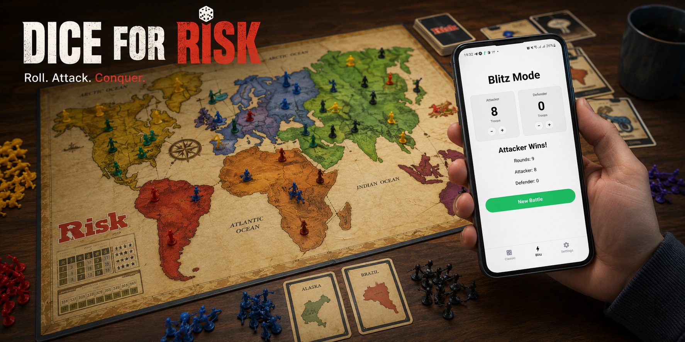
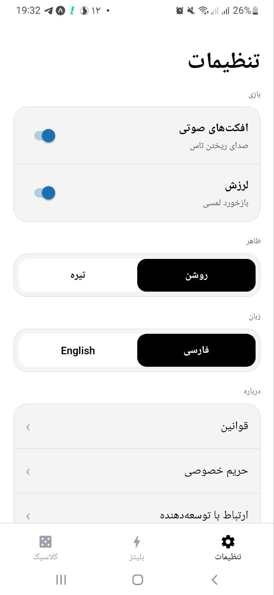
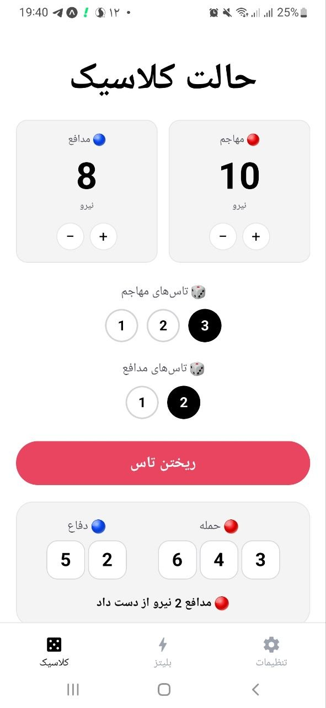
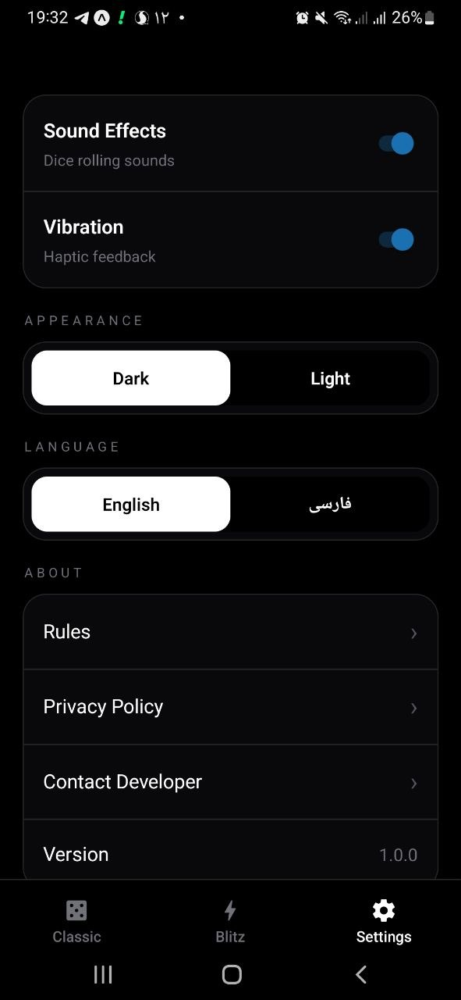
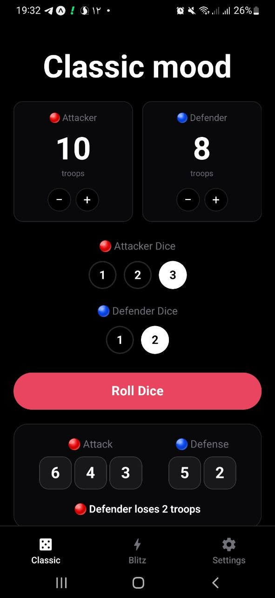
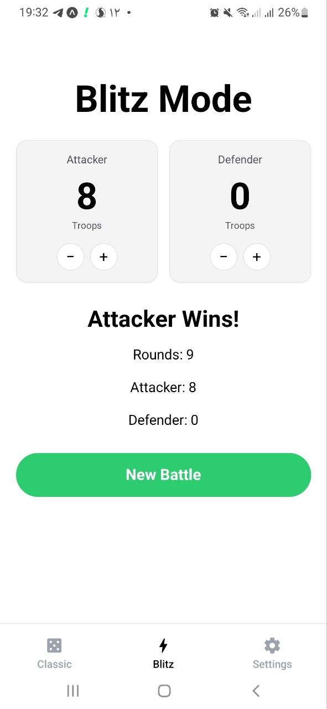

<div align="center">
  <h1>⚔️ Dice for Risk</h1>
  <p>
    A modern mobile companion app for the <strong>Risk</strong> board game,
    built with <strong>Expo</strong> and <strong>React Native</strong>.
  </p>
  
  
  
  
  
	
  <br />
  <br />
	
  


	
  
</div>

---

## 📸 Screenshots

<div align="center">
  
  
  
  <!-- 
  
  
   -->
</div>

---

## ✨ Features

### 🎲 Classic Mode

* Roll up to **3 attacker** and **2 defender** dice following official Risk rules
* Automatic dice comparison (highest dice compared first)
* Ties always go to the defender
* Real-time troop tracking
* Battle-over detection with winner announcement

### ⚡ Blitz Mode

* Simulate an entire battle instantly
* Automatic dice rolling until one side wins
* Displays total rounds played
* Final troop count summary

### 🌍 Localization

* Full support for **English** and **Persian (فارسی)**
* RTL layout support for Persian

### 🎨 Customization

* Light and dark themes
* Sound effects toggle
* Haptic feedback toggle

### 📱 User Experience

* Native mobile UI
* Haptic tab navigation
* Animated splash screen
* Responsive layouts optimized for phones

---

## 🛠 Tech Stack

| Tool                           | Purpose                        |
| ------------------------------ | ------------------------------ |
| Expo + Expo Router             | Framework & file-based routing |
| React Native + TypeScript      | UI & type safety               |
| NativeWind                     | Tailwind CSS for React Native  |
| React Native Safe Area Context | Safe area handling             |
| Expo Haptics                   | Haptic feedback                |
| pnpm                           | Package manager                |

---

## 🚀 Getting Started

### Prerequisites

* Node.js 18+
* pnpm
* Expo Go app or Android/iOS emulator

### Installation

```bash
git clone https://github.com/alimahdi-t/dice-for-risk.git
cd dice-for-risk
pnpm install
pnpm expo start
```

Then:

* Scan the QR code using Expo Go
* Press `a` for Android emulator
* Press `i` for iOS simulator

---

## 🎮 How It Works

### Classic Mode

1. Set attacker and defender troop counts
2. Select the number of dice each side rolls
3. Press **Roll Dice**
4. Dice are sorted from highest to lowest and compared
5. Troops are removed automatically
6. Battle ends when:

   * the defender reaches 0 troops, or
   * the attacker has only 1 troop remaining

> Official Risk rule: ties always go to the defender.

### Blitz Mode

1. Set attacker and defender troop counts
2. Press **Blitz**
3. The app automatically simulates the entire battle
4. View:

   * winner
   * remaining troops
   * number of rounds played

---

## ⚙️ Settings

The app includes:

* 🌙 Light/Dark theme selection
* 🔊 Sound effects toggle
* 📳 Haptic feedback toggle
* 🌐 Language selection (English/Persian)
* 📖 Rules page
* 🔒 Privacy policy page
* 👨‍💻 Contact developer page


---

## 📁 Project Structure

```text
app/
├── (tabs)/
│   ├── index.tsx         # Classic mode
│   ├── blitz.tsx         # Blitz mode
│   └── settings.tsx
├── rules.tsx
├── privacy.tsx
└── contact.tsx

components/
├── troop-card.tsx
├── dice-selector.tsx
├── result-panel.tsx
└── settings/

context/
└── settings-context.tsx

i18n/
└── index.ts

utils/
└── risk.ts
```

---

## 📜 License

This project is licensed under the MIT License.

---

<div align="center">
Made with ❤️ for Risk players.
</div>